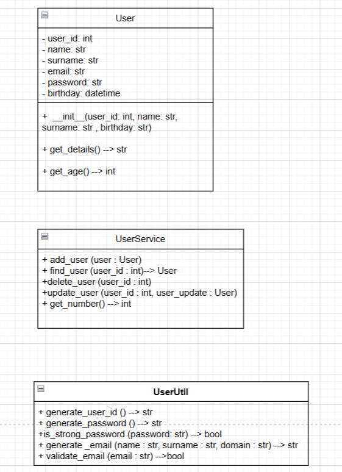

# User Management System

## Overview

The User Management System is an object-oriented Python application that allows for the management of user records. It includes functionalities for creating users, managing user data, and validating user information. The system is divided into three main classes: `User`, `UserService`, and `UserUtil`.

## Classes

### 1. User Class

The `User` class represents a user with the following attributes:
- `user_id`: Unique identifier for the user (integer).
- `name`: First name of the user (string).
- `surname`: Last name of the user (string).
- `email`: Email of the user (string).
- `password`: Password of the user (string).
- `birthday`: Birthday of the user (datetime).

#### Methods:
- `__init__(self, user_id, name, surname, birthday)`: Initializes the user's details.
- `get_details(self)`: Returns a formatted string containing user details.
- `get_age(self)`: Computes and returns the user’s age.

### 2. UserService Class

The `UserService` class manages users with the following class attribute:
- `users`: A dictionary to store all User objects (key is `user_id`, value is a `User` object).

#### Class Methods:
- `add_user(cls, user)`: Adds a User object to the users dictionary.
- `find_user(cls, user_id)`: Searches for a user by `user_id` and returns the user object if found.
- `delete_user(cls, user_id)`: Removes a user from the users dictionary by `user_id`.
- `update_user(cls, user_id, user_update)`: Updates user attributes using a `user_update` object.
- `get_number(cls)`: Returns the number of users in the users dictionary.

### 3. UserUtil Class

The `UserUtil` class provides utility functions with the following static methods:
- `generate_user_id()`: Generates a unique new user ID with 9 digits.
- `generate_password()`: Generates a new password with specific criteria.
- `is_strong_password(password)`: Checks if a given password meets strength requirements.
- `generate_email(name, surname, domain)`: Generates an email address using the user’s name and surname.
- `validate_email(email)`: Checks if the given email is in a valid format.
 
### OUTPUT:
User ID: 101010

Name: Zhalil Kachkynov

Email: zhalilkv@gmail.com

Birthday: 2002-07-09

Age: 22 #
###

User ID: 101010

Name: Zhalil KAchkynov

Email: zhalilkv@gmail.com

Birthday: 2002-07-09

Total Users: 2

Total Users after deletion: 1

###
Generated User ID: 259752963

Generated Password: =*D3bhvh

Password Strength Check: True

Generated Email: john.doe@example.com

Email Validation: True

